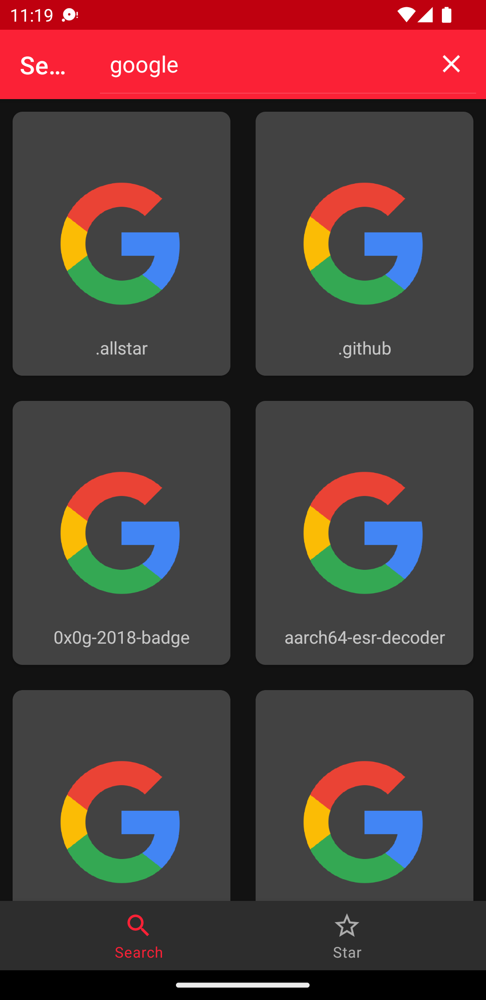
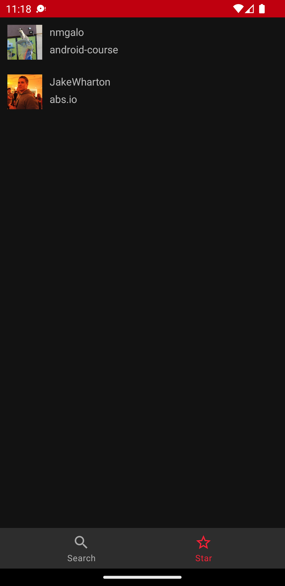

# Github Explorer

## Built With

* [Hilt](https://dagger.dev/hilt/) for DI
* [Coroutine Flow](https://kotlin.github.io/kotlinx.coroutines/kotlinx-coroutines-core/kotlinx.coroutines.flow/-flow/)
  An asynchronous data stream that sequentially emits values and completes normally or with an
  exception.
* [Retrofit](https://github.com/square/retrofit) A type-safe HTTP client for Android
* [kotlinx.serialization](https://github.com/Kotlin/kotlinx.serialization) Kotlin serialization
  consists of a compiler plugin, that generates visitor code for serializable classes, runtime
  library with core serialization API and support libraries with various serialization formats.
* [View Binding](https://developer.android.com/topic/libraries/view-binding) A support library that
  allows you to bind UI components in your layouts to data sources in your app using a declarative
  format rather than programmatically.
* [Navigation Component](https://developer.android.com/guide/navigation) helps you implement
  navigation, from simple button clicks to more complex patterns, such as app bars and the
  navigation drawer.
* [ViewModel](https://developer.android.com/topic/libraries/architecture/viewmodel) class is
  designed to store and manage UI-related data in a lifecycle conscious way.
* [coil](https://coil-kt.github.io/coil/)  An image loading library for Android backed by Kotlin
  Coroutines. Coil is: Fast: Coil performs a number of optimizations including memory and disk
  caching

## Preview

    
    

## Installation

Clone project to Android Studio

Copy `local.defaults.properties` to `secrets.properties` file and fill credentials.

With command

- In Linux/Mac - `cp local.defaults.properties secrets.properties`
- Windows -  `copy local.defaults.properties secrets.properties`

## Goals and requirements

The goals for the app architecture are:

* Follow the [official architecture guidance](https://developer.android.com/jetpack/guide) as
  closely as possible.
* Easy for developers to understand, nothing too experimental.
* Support multiple developers working on the same codebase.
* Minimize build times.

## Architecture overview

The app architecture has three layers:
a [data layer](https://developer.android.com/jetpack/guide/data-layer),
[domain layer](https://developer.android.com/topic/architecture/domain-layer)
and [UI layer](https://developer.android.com/jetpack/guide/ui-layer).

##### Presentation Layer Architecture: MVVM

## UI

As I don't want to make this project experimental, i decided to use well-known XML Based layouts.
What can I say? I'm still studying jetpack compose ;))

## Things to improve

* Fix UX/UI
* Rewrote paging library, I'm using clean architecture at this project, unfortunately androidx
  paging library doesn't work with that, Also `github` api doesn't provides basic pagination info
  for user repositories, e.g:
  total page, is last page, etc...
* Needs more tests
